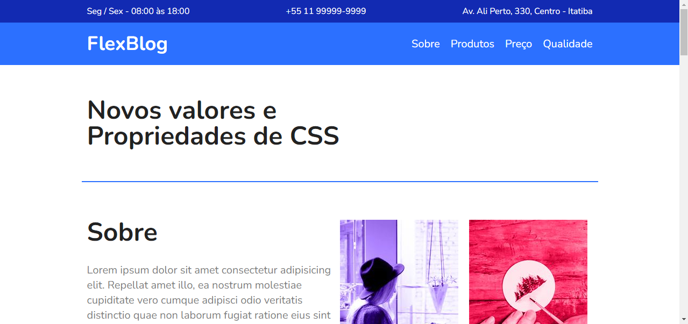

# FlexBlog
> Um site que foi feito para poder aprender sobre flexbox em CSS

Esse é um projeto de uma página estática de um site feito com bastante elementos em Flexbox.

Foi feito para poder aprimorar minhas técnicas em CSS Flexbox.

## Meta

Lincoln Berto - [LinkedIn]("https://www.linkedin.com/in/lincolnberto/") - lincolnbsantos@hotmail.com.com
